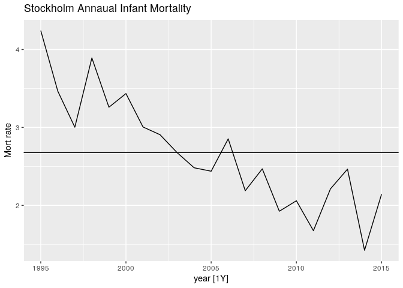
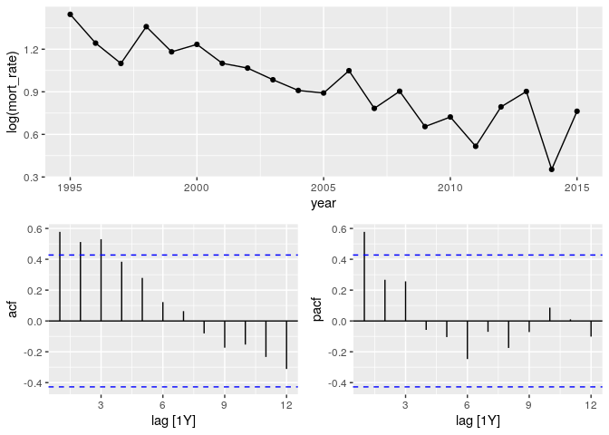
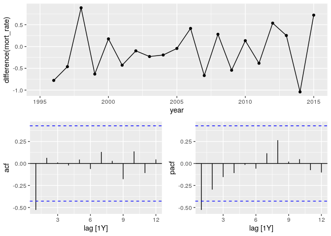
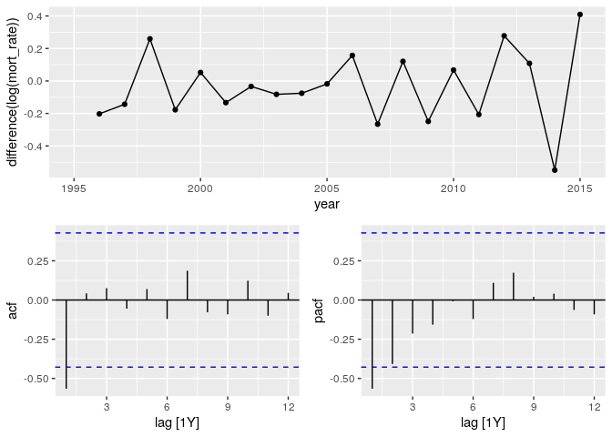
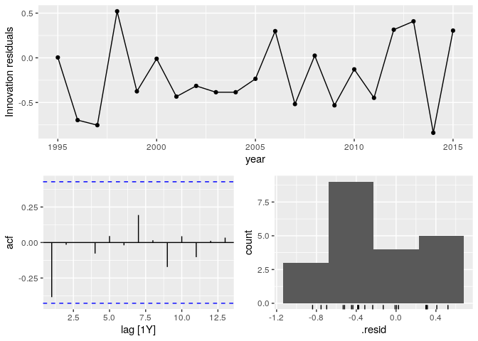
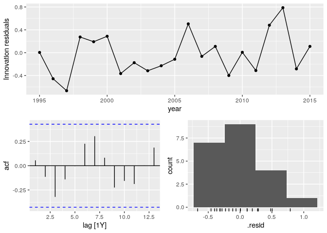
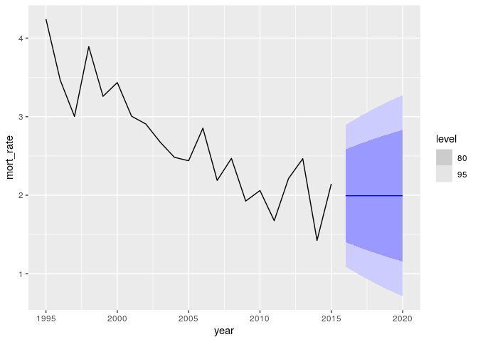
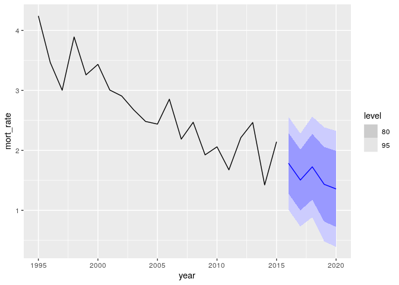

## Overview

This project applies classical time series analysis to Sweden infant
mortality rates. The data set under anlysis comes from the one in
[Bayesian Demographic Estimation and
Forecasting](https://www.taylorfrancis.com/chapters/mono/10.1201/9780429452987-11/infant-mortality-sweden-john-bryant-junni-zhang).

This project’s analysis framework is based on the one presented in:
[Forecasting: Principles and
Practice](https://otexts.com/fpp3/arima-r.html).

## Analyse Raw Data

### Observed data

<!-- -->

## 

## Transformations

The data is visually assessed to see if transformation or differencing
is required. Additionally a KPSS test is performed in which the null
hypothesis is that the data is stationary (small p-value -\>
differencing is requried).

Logging the data appears to do little in altering the shape of the data.
Differencing appears to make the data more stationary. Also KPSS p-value
of the orignal series is reported as .01 which indicates to reject the
null. The KPSS p-value for the diffed series is reported as 0.1.
Therefore diffed data will be used for model selection.

### actual-data

<!-- -->

    ## # A tibble: 1 × 3
    ##   county    kpss_stat kpss_pvalue
    ##   <chr>         <dbl>       <dbl>
    ## 1 Stockholm     0.775        0.01

### log-data

<!-- -->

    ## # A tibble: 1 × 3
    ##   county    kpss_stat kpss_pvalue
    ##   <chr>         <dbl>       <dbl>
    ## 1 Stockholm     0.776        0.01

### diff-data

<!-- -->

    ## # A tibble: 1 × 3
    ##   county    kpss_stat kpss_pvalue
    ##   <chr>         <dbl>       <dbl>
    ## 1 Stockholm     0.223         0.1

### logdiff-data

<!-- -->

    ## # A tibble: 1 × 3
    ##   county    kpss_stat kpss_pvalue
    ##   <chr>         <dbl>       <dbl>
    ## 1 Stockholm     0.166         0.1

## 

## Model Selection

The ACF appears to be significant at lag 1 and then cut off. The PACF
appears to show geometric decay. I will choose an MA(1) model for the
diffed series or ARIMA(0,1,1) on the original (ie the airline model).
The automatic model was performed using the stepwise [Hyndman-Khandakar
algorithm](https://otexts.com/fpp3/arima-r.html). The algorithm chose an
ARIMA(2,1,0) Which I would have never chosen by looking at the ACF and
PACF.

Summary of manual model and automatic model:

    ## # A tibble: 2 × 9
    ##   county    .model   sigma2 log_lik   AIC  AICc   BIC ar_roots  ma_roots 
    ##   <chr>     <chr>     <dbl>   <dbl> <dbl> <dbl> <dbl> <list>    <list>   
    ## 1 Stockholm arima011  0.212  -12.5   29.0  29.7  31.0 <cpl [0]> <cpl [1]>
    ## 2 Stockholm stepwise  0.156   -8.74  25.5  28.1  29.5 <cpl [2]> <cpl [0]>

### Manual

<!-- -->

    ## Series: mort_rate 
    ## Model: ARIMA(0,1,1) 
    ## 
    ## Coefficients:
    ##           ma1
    ##       -0.4950
    ## s.e.   0.1509
    ## 
    ## sigma^2 estimated as 0.2118:  log likelihood=-12.49
    ## AIC=28.97   AICc=29.68   BIC=30.96

### Auto

<!-- -->

    ## Series: mort_rate 
    ## Model: ARIMA(2,1,0) w/ drift 
    ## 
    ## Coefficients:
    ##           ar1      ar2  constant
    ##       -0.9404  -0.5319   -0.2342
    ## s.e.   0.2191   0.2326    0.0856
    ## 
    ## sigma^2 estimated as 0.1559:  log likelihood=-8.74
    ## AIC=25.47   AICc=28.14   BIC=29.45

## 

## Forecast

### Manual

<!-- -->

### Auto

<!-- -->

##
